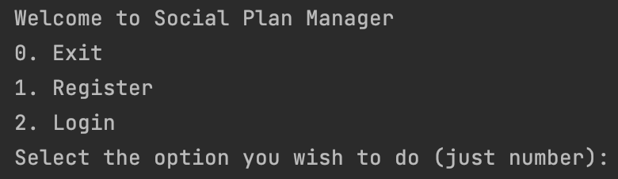
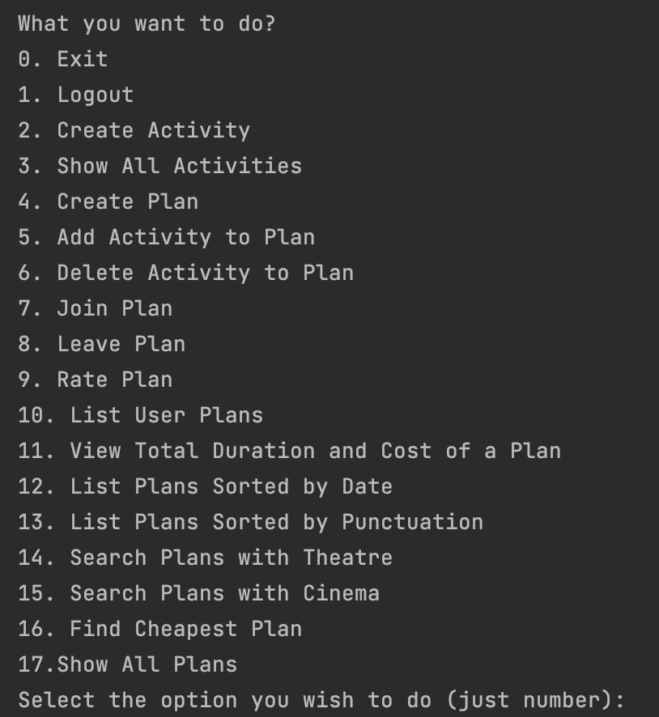
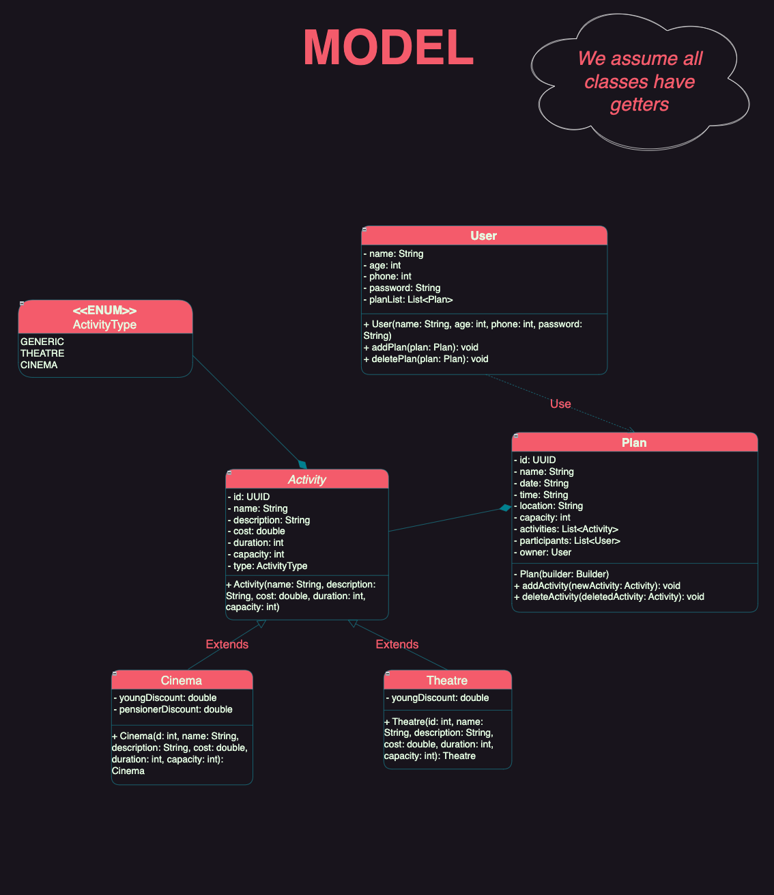
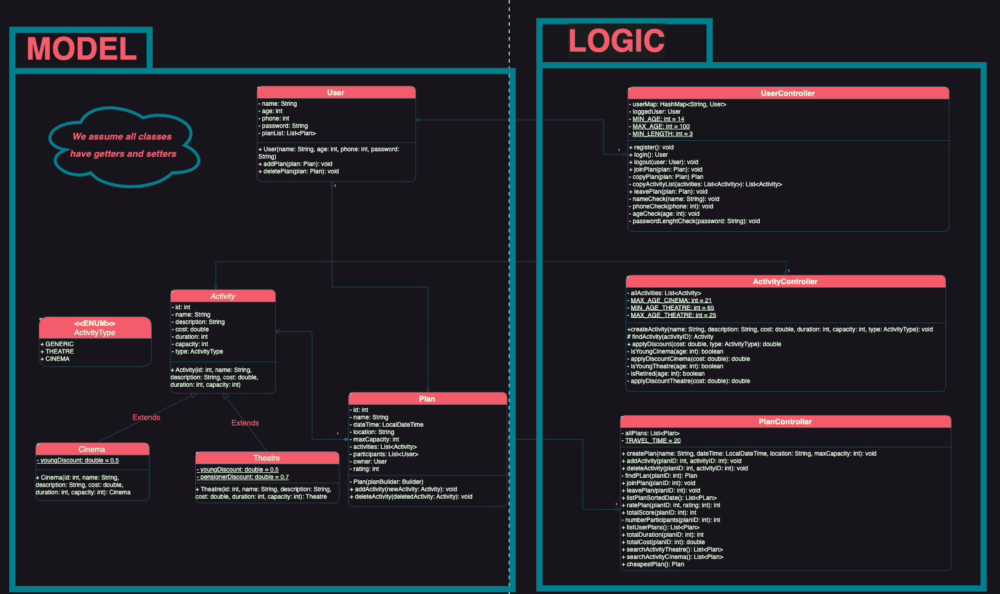
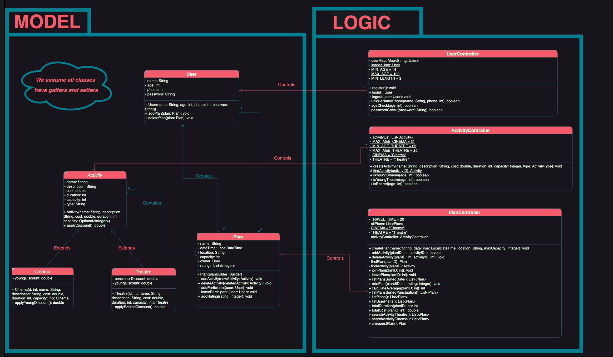
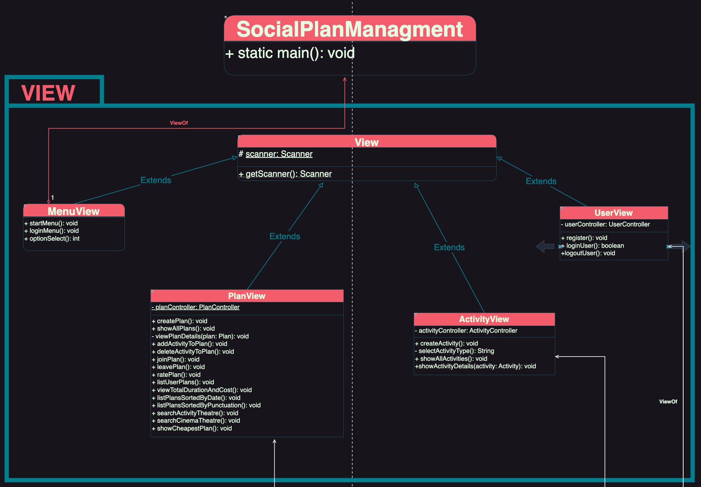
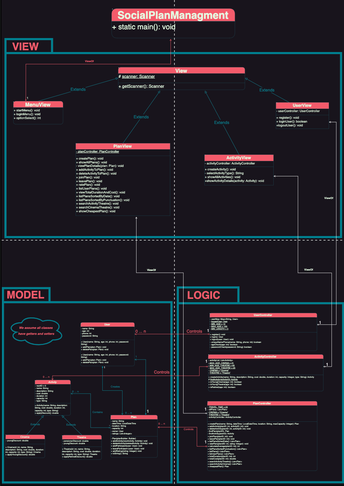

# Social Plan Management Application

## Documentation

### Documentación de como ejecutar todas las operaciones:

Para ejecutar todas las posibles operaciones que ofrece este programa es importante resaltar que he decidido crear un programa que utilice un Menu en vez de que cada comando reciba un parámetro. Esto permite que el programa sea mucho más legible y flexible, ya que el usuario puede ver todas las opciones, y elegir la deseada utilizando los ID's de cada opción. (Se puede comprobar como es este menu en la figura 1 y en la figura 2)

Pasos:
1. Una vez que proyecto está clonado, y nos encontramos en la raíz del mismo, hay que ejecutar el siguiente comando:

   ``
   cd SocialPlanManagementApplication
   ``

2. Una vez que nos encontramos en el directorio del código fuente será necesario ejecutar los siguientes comandos en orden. Es importante resaltar que es necesario tener Maven instalado, ya que este proyecto se ha construido utilizando este gestor de dependencias
shell 

   ``
   mvn clean install -DskipTests
   ``

 
   ``
   mvn compile exec:java -Dexec.mainClass="org.example.Main"
   ``

3. Una vez que estos commandos hayan sido ejecutados ya podremos ver el menu donde podremos empezar a interacutar con nuestro gestor de planes sociales.

#### Menu inicial

[Figura 1]

Como se evidencia en la Figura 1, el menú brinda al usuario la posibilidad de seleccionar la acción que desea realizar. Puede registrarse en la aplicación en caso de no haberse registrado previamente, iniciar sesión si desea acceder, o salir del programa. 
Estas opciones proporcionan una experiencia fluida y personalizada para gestionar las interacciones con la aplicación. 

#### Menu de acciones

[Figura 2]

Adicionalmente, tal como se observa en la Figura 2, una vez que se ha iniciado la sesión, se abren diversas posibilidades para el usuario. Entre estas opciones se incluyen la capacidad de crear actividades o planes, eliminarlos, así como la posibilidad de asignar puntuaciones. 
Este conjunto de funciones amplía las posibilidades de interacción y personalización dentro de la aplicación, brindando al usuario un mayor control sobre sus actividades.

## UML Model Submission 1

## UML Model and Logic Submission 2

## UML Model and Logic Submission 3

## UML Model, Logic and Views Submission 4

## UML Diagram Submission 4
